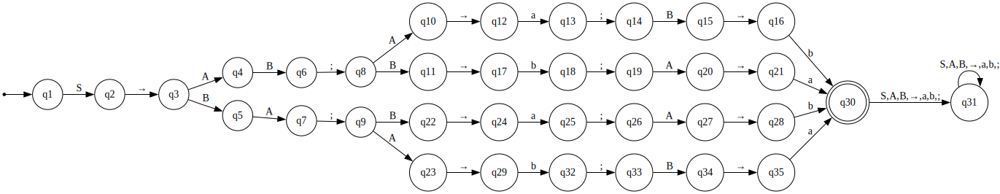
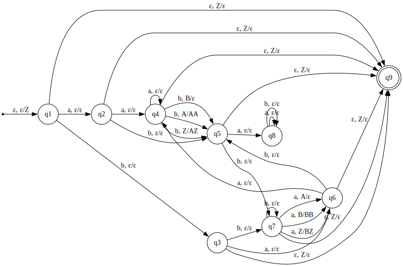

Вариант 24

1. Язык контекстно-свободных грамматик в нормальной форме Хомского, порождающих язык из единственного слова, {ab}. Слова языка могут включать нетерминалы S (где S стартовый), A, B, символ →, терминалы a, b и разделитель ;.

Алфавит `{S,A,B,→,a,b,;}`

Язык состоит из этих 4 слов:

1. `S→AB;A→a;B→b`
2. `S→BA;A→b;B→a`
3. `S→AB;B→b;A→a`
4. `S→BA;B→a;A→b`

Регулярное выражение
`S→(AB;(A→a;B→b|B→b;A→a)|BA;(B→a;A→b|A→b;B→a))

ДКА

2. Язык {w | |w|aab = |w|bba & |w|aba = 0}. Алфавит {a,b}.
PDA:

3. Язык слов {w1w2w3 | |w1| = |w3| > |w2| & |w1|ab = |w3|ba}. Алфавит {a,b,c}.

Возьмем пересечение языка с регулярным языком (ab)* c* (ba)* c*
Докажем, что это пересечение не КС по лемме о Накачке. Для длины накачки p возьмем
n = p и строку (ab)ⁿc²ⁿ(ba)ⁿc²ⁿ 

Строка делится на w1w2w3, единственным способом, если поделить её пополам на w1 и w3.
Докажем, что разбиение единственное.
Для того, чтобы слово удовлетворяло условию |w1| = |w3| > |w2|,
 |w1| и |w3| должны быть больше 1/3 |w1w2w3|. Следовательно, первые (ab)^n входят в w1, а значит все ba^n должны входить в w3, чтобы выполнялось |w1|ab = |w3|ba. А тогда, чтобы  |w1| был равен |w3| весь префикс (ab)ⁿ  c²ⁿ должен входить в w1.

Разделим строку на 4 блока:
b1 = (ab)ⁿ 
b2 = c²ⁿ 
b3 = (ba)ⁿ 
b4 = cⁿ 

При накачке в b1 при i=n меняется баланс между количеством ab в w1 и ba в w3.
При накачке в b2 при i=0 становится невозможно разделить на w1w2w3, удовлетворяющее условиям(Не хватает длины левой части для того, чтобы уравнять все ba в правой части).
При накачке в b3 при i=0  меняется баланс между количеством ab в w1 и ba в w3.
При накачке в b4 при i=4n невозможно выбрать разбиение, т.к. в правой части не будет ba.

При накачке в b1 и b2 при i=n также, как и при накачке b1 меняется баланс между количеством ab в w1 и ba в w3.
При накачке в b2 и b3 при i = 0 также, как и при накачке b3 меняется баланс между количеством ab в w1 и ba в w3.
При накачке в b3 и b4 при i=0 становится невозможно выбрать в правой части ba, чтобы компенсировать ab в левой.

При других накачках ломается регулярность языка. 
Таким образом, язык не КС по лемме о накачке. А значит и исходный язык не КС.
