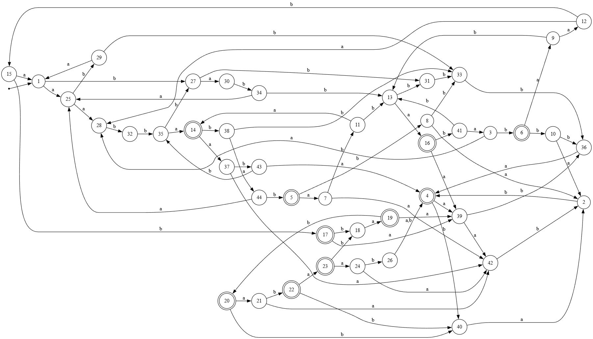
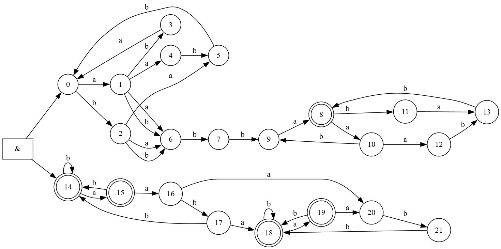

## Регулярное выражение

`(aba|bab|aabb)*(a|b)(a|b)bba(aba|bab|aabb)*`  Вариант 24
## ДКА

Таблица, доказывающая минимальность ДКА

| prefix\suffix        | ε   | b   | ba  | ab  | bb  | a   | abba | bba | bbbb | ababbb | babbb | abbbb | abb | abbb | abaabba | aaabba | baabba | bbabbb |
| :------------------- | --- | --- | --- | --- | --- | --- | ---- | --- | ---- | ------ | ----- | ----- | --- | ---- | ------- | ------ | ------ | ------ |
| ε                    | -   | -   | -   | -   | -   | -   | -    | -   | -    | -      | -     | -     | -   | -    | -       | -      | -      | -      |
| abbbaba              | -   | +   | -   | -   | -   | -   | -    | -   | +    | -      | -     | -     | -   | -    | -       | -      | -      | -      |
| babbaba              | -   | +   | -   | -   | -   | -   | +    | -   | -    | -      | -     | -     | -   | -    | -       | -      | -      | -      |
| abbba                | +   | -   | -   | -   | -   | -   | -    | -   | -    | +      | -     | -     | -   | -    | -       | -      | -      | -      |
| aabbabab             | +   | -   | -   | -   | -   | -   | +    | -   | -    | -      | -     | -     | -   | -    | +       | -      | -      | -      |
| babbabab             | +   | -   | -   | -   | -   | -   | -    | +   | -    | -      | -     | -     | -   | -    | -       | +      | -      | +      |
| aabbababa            | -   | -   | +   | -   | -   | -   | -    | +   | -    | -      | -     | -     | +   | -    | -       | -      | +      | -      |
| aabbababb            | -   | -   | -   | +   | -   | -   | -    | +   | -    | -      | -     | +     | -   | -    | -       | -      | -      | +      |
| babbababa            | -   | -   | +   | -   | -   | -   | -    | -   | -    | -      | -     | -     | +   | -    | -       | -      | -      | -      |
| babbababb            | -   | -   | +   | +   | -   | -   | -    | -   | -    | -      | +     | +     | -   | -    | -       | -      | -      | -      |
| aabbababab           | -   | -   | +   | -   | -   | +   | -    | -   | -    | -      | -     | -     | -   | -    | -       | -      | -      | -      |
| babbababaa           | -   | -   | -   | -   | +   | -   | +    | -   | -    | -      | -     | -     | -   | -    | -       | -      | -      | -      |
| babb                 | -   | -   | -   | -   | -   | +   | +    | -   | -    | -      | -     | -     | -   | -    | +       | -      | -      | -      |
| aabba                | +   | -   | -   | -   | -   | -   | +    | -   | -    | +      | -     | -     | -   | -    | -       | -      | -      | -      |
| babbababaab          | -   | +   | -   | -   | -   | -   | -    | +   | -    | -      | -     | -     | -   | -    | -       | +      | -      | -      |
| babba                | +   | -   | -   | -   | -   | -   | -    | +   | -    | +      | -     | -     | -   | -    | -       | -      | +      | -      |
| babbababaabb         | +   | -   | +   | -   | -   | -   | -    | -   | -    | +      | -     | -     | -   | -    | -       | -      | -      | -      |
| babbababaabbb        | -   | -   | -   | +   | -   | +   | -    | -   | -    | -      | -     | +     | -   | -    | -       | -      | -      | -      |
| babbababaabbba       | +   | +   | -   | -   | -   | -   | -    | -   | +    | +      | -     | -     | -   | -    | -       | -      | -      | -      |
| babbababaabbbab      | +   | -   | -   | +   | -   | -   | -    | -   | -    | -      | -     | +     | -   | -    | -       | -      | -      | -      |
| babbababaabbbaba     | -   | +   | +   | -   | -   | -   | -    | -   | +    | -      | -     | -     | +   | -    | -       | -      | -      | -      |
| babbababaabbbabab    | +   | -   | -   | -   | -   | +   | -    | -   | -    | -      | -     | -     | -   | -    | -       | -      | -      | -      |
| babbababaabbbababa   | +   | -   | +   | -   | -   | -   | -    | -   | -    | +      | -     | -     | +   | -    | -       | -      | -      | -      |
| babbababaabbbababaa  | -   | -   | +   | -   | +   | -   | -    | -   | -    | -      | +     | -     | +   | -    | -       | -      | -      | -      |
| a                    | -   | -   | -   | -   | -   | -   | +    | -   | -    | -      | -     | -     | -   | -    | -       | -      | -      | -      |
| babbababaabbbababaab | -   | +   | -   | -   | -   | +   | -    | -   | +    | -      | -     | -     | -   | +    | -       | -      | -      | -      |
| b                    | -   | -   | -   | -   | -   | -   | +    | -   | -    | -      | -     | -     | -   | -    | +       | -      | -      | -      |
| aa                   | -   | -   | -   | -   | -   | -   | -    | +   | -    | -      | -     | -     | -   | -    | -       | -      | -      | -      |
| ab                   | -   | -   | -   | -   | -   | -   | -    | +   | -    | -      | -     | -     | -   | -    | -       | +      | -      | +      |
| ba                   | -   | -   | -   | -   | -   | -   | -    | +   | -    | -      | -     | -     | -   | -    | -       | -      | +      | -      |
| bb                   | -   | -   | -   | -   | -   | -   | -    | +   | -    | -      | -     | -     | -   | -    | -       | -      | -      | +      |
| aab                  | -   | -   | +   | -   | -   | -   | -    | -   | -    | -      | -     | -     | -   | -    | -       | -      | +      | -      |
| abb                  | -   | -   | +   | -   | -   | -   | -    | -   | -    | -      | +     | -     | -   | -    | -       | -      | -      | -      |
| bab                  | -   | -   | +   | -   | -   | -   | -    | -   | -    | -      | -     | -     | -   | -    | -       | -      | -      | -      |
| aabb                 | -   | -   | -   | -   | -   | +   | -    | -   | -    | -      | -     | -     | -   | -    | -       | -      | -      | -      |
| abbb                 | -   | -   | -   | -   | -   | +   | -    | -   | -    | -      | -     | -     | -   | +    | -       | -      | -      | -      |
| aabbaa               | -   | -   | +   | -   | -   | -   | -    | +   | -    | -      | +     | -     | +   | -    | -       | -      | -      | -      |
| aabbab               | -   | -   | -   | +   | -   | -   | -    | +   | -    | -      | -     | -     | -   | -    | -       | +      | -      | +      |
| abbbaa               | -   | -   | +   | -   | -   | -   | -    | -   | -    | -      | +     | -     | +   | -    | -       | -      | -      | -      |
| abbbab               | -   | -   | -   | +   | +   | -   | -    | -   | -    | -      | -     | +     | -   | -    | -       | -      | -      | -      |
| babbab               | -   | -   | +   | +   | -   | -   | -    | -   | -    | -      | -     | -     | -   | -    | -       | -      | -      | -      |
| aabbaaa              | -   | -   | -   | -   | +   | -   | -    | -   | -    | -      | -     | -     | -   | -    | -       | -      | -      | -      |
| aabbaab              | -   | -   | +   | -   | -   | +   | -    | -   | -    | -      | -     | -     | -   | +    | -       | -      | +      | -      |
| aabbaba              | -   | +   | -   | -   | -   | -   | -    | -   | -    | -      | -     | -     | -   | -    | -       | -      | -      | -      |

## НКА

Таблица, доказывающая минимальность НКА

| prefix \ suffix | ε   | b   | a   | bb  | ba  | abb | aabba | abbbba | bbbbba | bbbbbba | bba | abbbbbba |
| --------------- | --- | --- | --- | --- | --- | --- | ----- | ------ | ------ | ------- | --- | -------- |
| ε               | -   | -   | -   | -   | -   | -   | +     |        |        |         |     |          |
| a               | -   | -   | -   | -   | -   | -   | -     | -      | -      | -       | -   | +        |
| b               | -   | -   | -   | -   | -   | -   | -     | -      | -      | -       | -   | -        |
| aa              | -   | -   | -   | -   | -   | -   | -     | -      | -      | +       |     |          |
| ab              | -   | -   | -   | -   | -   | -   | -     | +      |        |         |     |          |
| ba              | -   | -   | -   | -   | -   | -   | -     | -      | +      |         |     |          |
| bb              | -   | -   | -   | -   | -   | -   | -     | -      | -      | -       | +   |          |
| aab             | -   | -   | -   | -   | +   | -   |       |        |        |         |     |          |
| aabb            | -   | -   | +   |     |     |     |       |        |        |         |     |          |
| aabba           | +   |     |     |     |     |     |       |        |        |         |     |          |
| aabbaa          | -   | -   | -   | -   | +   | +   |       |        |        |         |     |          |
| aabbab          | -   | -   | -   |     |     |     |       |        |        |         |     |          |
| aabbaaa         | -   | -   | -   | +   |     |     |       |        |        |         |     |          |
| aabbaba         | -   | +   |     |     |     |     |       |        |        |         |     |          |

## ПКА

Каждая последовательность из aa обязательно продолжается bb,сновыва везде, кроме, возможно, одного раза, если в центре находится ..bba aba или ..bba aabb. Можем построить ПКА ниже:

Таблица, частично обосновывающая минимальность ПКА
| prefix \ suffix | a   | ε   | baabba | bba |
| --------------- | --- | --- | ------ | --- |
| babba           | -   | +   | +      | +   |
| ba              | -   | -   | +      | +   |
| aa              | -   | -   | -      | +   |
| ε               | -   | -   | -      | -   |

## Расширенное регулярное выражение

`(aba|bab|aabb)*(a|b)(a|b)bba(aba|bab|aabb)*`

Добавим маркеры начала и конца и заменим центральные `(a∣b)` на `.` 

`^(aba|bab|aabb)*..bba(aba|bab|aabb)*$`

Над алфавитом {a, b} это выражение будет эквивалентно изначальному.

Также можно заменить замыкание клини на опцию от положительной итерации и система останется эквивалентной.

`^((aba|bab|aabb)+)?..bba((aba|bab|aabb)+)?$`

## Fuzz тестирование

Возникли трудности с тем, чтобы протестировать на словах, принадлежащих языку, за приемлемое время при случайно генерируемых словах, поэтому написал генератор таких слов и два теста - FuzztestLWord и FuzztestRandomWord. 
